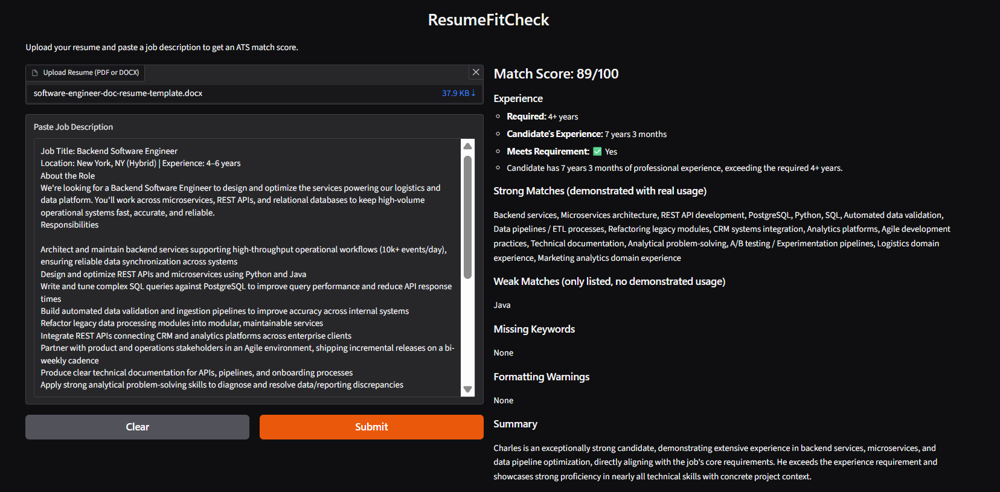

# ResumeFitCheck

Part of the **JobPilot** project series — a multi-agent job search assistant.

## What this does
Takes a resume and a job description, and returns:
- An ATS match score (0–100)
- Experience check (required vs. candidate's experience, pass/fail)
- Strong matches — skills/keywords demonstrated with real usage
- Weak matches — skills only listed, without demonstrated usage
- Missing keywords / gaps
- Formatting warnings that could hurt ATS parsing
- A plain-language summary of overall fit

## Screenshot



## Status
🛠️ Core flow working — resume upload, JD paste, and match scoring are functional end-to-end. Project 1 of 5 in the JobPilot series.

## Tech Stack
- **Backend:** Python, FastAPI
- **LLM:** Google Gemini API (Flash-Lite)
- **Frontend:** React (Vite) + Tailwind CSS
- **Parsing:** pdfplumber / python-docx

## Setup

### Backend
```bash
cd backend
python -m venv venv
source venv/bin/activate  # or venv\Scripts\activate on Windows
pip install -r requirements.txt
cp .env.example .env  # then add your Gemini API key
uvicorn main:app --reload
```

### Frontend
```bash
cd frontend
npm install
npm run dev
```

## Environment Variables
See `.env.example` for required keys.

## Part of JobPilot
This is one of five standalone sub-projects that combine into the final **JobPilot** multi-agent system:
1. **ResumeFitCheck** (this repo) — resume/JD scoring
2. JobScout — job search & recommendations
3. CoverCraft — AI cover letter writer
4. ApplyTrack — application tracker
5. JobPilot — final orchestration of all agents